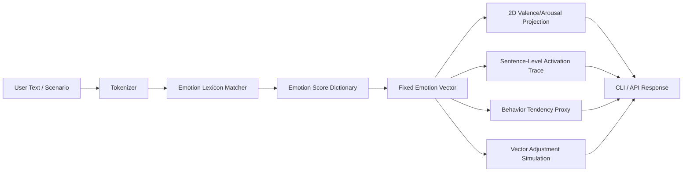
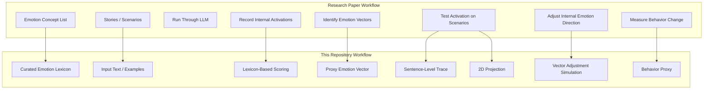
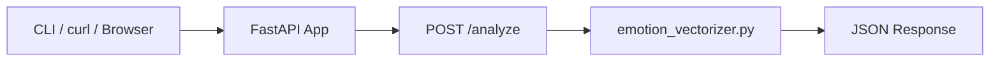

# POC AI Emotional Vectors

A small, explainable proof-of-concept inspired by Anthropic's research paper **"Emotion Concepts and their Function in a Large Language Model"**.

This repository does **not** claim that AI systems truly feel emotions. It demonstrates, in a simple and teachable way, how text can be converted into emotion-like vectors, traced across a sequence, projected into a simple visual space, compared across scenarios, and conceptually adjusted to explain the major ideas from the research paper.

Paper reference:

- Transformer Circuits Thread: https://transformer-circuits.pub/2026/emotions/index.html
- Anthropic research summary: https://www.anthropic.com/research/emotion-concepts-function

---

## 1. Why this POC exists

The paper studies how a large language model can contain internal emotion-related representations. The researchers identify neural activity patterns associated with emotion concepts such as happy, afraid, calm, desperate, angry, loving, surprised, and others.

The key research idea is:

> An emotion concept can be represented as a direction or pattern in model activation space, and that representation can influence model behavior.

This POC converts that idea into a beginner-friendly engineering project.

Instead of directly reading transformer activations from a production LLM, this project uses a transparent **lexicon-based proxy**:

1. Read input text.
2. Detect emotion-related signals using keyword dictionaries.
3. Convert the detected signals into a fixed-length vector.
4. Project the vector into valence/arousal space.
5. Trace how the vector changes sentence by sentence.
6. Simulate how adjusting one emotion dimension changes the behavior proxy.
7. Expose the workflow through CLI, FastAPI, examples, and tests.

---

## 2. Important disclaimer

This project is an **educational approximation**, not a reproduction of Anthropic's internal experiments.

The paper works with real model internals, activation patterns, and controlled intervention experiments inside Claude Sonnet 4.5. This repository does not access hidden states, residual streams, neurons, sparse autoencoders, or production model internals.

The purpose of this POC is to help a learner understand the concepts sequentially before moving to a real mechanistic interpretability implementation.

---

## 3. Does this POC cover the major concepts of the paper?

Yes, after this update, the POC covers the **major concepts at a conceptual/proxy level**.

It does **not** fully reproduce the paper technically because that would require access to real transformer activation data and controlled internal model interventions.

| Research paper concept | What the paper does | What this POC implements | Coverage |
|---|---|---|---|
| Emotion concepts | Studies many emotion concepts. | Uses joy, sadness, fear, anger, curiosity, empathy, calm, desperation, pride, guilt, and surprise. | Proxy covered |
| Emotion vectors | Identifies activation directions associated with emotions. | Builds a fixed-order emotion vector from transparent text scoring. | Proxy covered |
| Activation tracking | Measures when emotion vectors activate in context. | Provides sentence-level `activation_trace`. | Proxy covered |
| Locality | Shows emotion vectors can track current/upcoming emotional content. | Shows dominant emotion can shift sentence by sentence. | Proxy covered |
| Valence/arousal structure | Finds meaningful organization among emotion concepts. | Projects scores into `x_valence` and `y_arousal`. | Proxy covered |
| Functional emotions | Shows representations can affect behavior. | Adds a transparent `behavior_proxy` based on pressure vs regulation. | Proxy covered |
| Internal intervention | Adjusts emotion directions in a model and observes behavior changes. | Adds `simulate_steering()` as a conceptual vector-adjustment demo. | Conceptually covered |
| Internal state vs visible text | Shows internal activations can matter even without visible emotional wording. | Explained as a limitation and future extension. | Partially covered |
| Pretraining vs post-training | Analyzes how training stages shape activation. | Documented as future work. | Not implemented |
| Real mechanistic interpretability | Uses actual model internals. | Not implemented. | Not covered |

---

## 4. Sequential learning flow

Use this repository in the following order.

### Step 1: Understand emotion concepts

A text can contain signals associated with multiple emotional concepts.

Example:

```text
The tests keep failing, the deadline is urgent, and I feel stuck.
```

This input contains pressure-related cues:

- failing
- deadline
- urgent
- stuck

The POC maps those cues to dimensions such as `desperation` and `fear`.

### Step 2: Convert concepts into a vector

The POC keeps a fixed list of emotion dimensions.

```python
[
  "joy",
  "sadness",
  "fear",
  "anger",
  "curiosity",
  "empathy",
  "calm",
  "desperation",
  "pride",
  "guilt",
  "surprise"
]
```

For every input text, the system returns one numeric value for each dimension.

### Step 3: Project the vector into emotional space

The POC projects the full vector into two simple dimensions.

| Projection | Meaning |
|---|---|
| `x_valence` | Positive emotion balance minus negative emotion balance |
| `y_arousal` | Intensity/activation level based on high-arousal emotions |

### Step 4: Trace local activation

The paper explains that emotion vectors can be local. The active representation can change based on the current part of the context.

This POC approximates that by splitting the input into sentence-level chunks.

Example:

```text
The missing document was unexpected and strange. After checking again, I feel calm and ready to explain the issue.
```

Possible trace:

```json
[
  {"step": 1, "dominant_emotion": "surprise"},
  {"step": 2, "dominant_emotion": "calm"}
]
```

### Step 5: Estimate behavior tendency

The paper's important claim is not just that emotion vectors exist, but that they are **functional**. They can influence model behavior.

This POC adds a simple behavior proxy:

```text
pressure = desperation + fear + anger
regulation = calm + empathy + curiosity
risk_score = pressure - regulation + baseline
```

The output is not a real safety classifier. It is a transparent teaching proxy.

### Step 6: Simulate vector adjustment

The paper adjusts an emotion direction inside the model and observes how behavior changes.

This POC cannot adjust a real model internally. Instead, it demonstrates the concept by changing one emotion dimension directly in the vector using `simulate_steering()`.

### Step 7: Compare emotional similarity between scenarios

The POC also supports comparing multiple texts using cosine similarity.

This helps explain whether two scenarios activate similar emotion profiles.

---

## 5. High-level architecture



---

## 6. Research-to-POC architecture mapping



---

## 7. API architecture



The core logic now also supports additional Python-level functions: `compare_texts()`, `simulate_steering()`, and `research_concept_coverage()`.

---

## 8. Folder structure

```text
POC_AI_Emotional_Vectors/
├── app/
│   ├── __init__.py
│   ├── api.py
│   ├── cli.py
│   └── emotion_vectorizer.py
├── examples/
│   └── sample_inputs.json
├── tests/
│   └── test_emotion_vectorizer.py
├── .gitignore
├── README.md
└── requirements.txt
```

---

## 9. Core files explained

| File | Purpose |
|---|---|
| `app/emotion_vectorizer.py` | Main research-inspired logic: scoring, vectors, local trace, projection, vector adjustment simulation, behavior proxy, and coverage explanation. |
| `app/api.py` | FastAPI wrapper exposing the basic `/analyze` endpoint. |
| `app/cli.py` | Command-line demo for quickly analyzing one text. |
| `examples/sample_inputs.json` | Example scenarios aligned to paper-inspired concepts. |
| `tests/test_emotion_vectorizer.py` | Unit tests for analysis, local trace, vector adjustment, comparison, and concept coverage. |
| `requirements.txt` | Minimal dependencies for API and testing. |

---

## 10. Quick start

### 10.1 Clone the repository

```bash
git clone https://github.com/AkileshVishnu/POC_AI_Emotional_Vectors.git
cd POC_AI_Emotional_Vectors
```

### 10.2 Create a virtual environment

Mac/Linux:

```bash
python -m venv .venv
source .venv/bin/activate
```

Windows PowerShell:

```powershell
python -m venv .venv
.venv\Scripts\Activate.ps1
```

### 10.3 Install dependencies

```bash
pip install -r requirements.txt
```

---

## 11. Run the CLI demo

```bash
python -m app.cli "I am excited to learn this but also nervous about the risk."
```

The response includes:

- emotion scores
- dominant emotion
- vector labels
- fixed emotion vector
- 2D coordinates
- sentence-level activation trace
- behavior proxy
- research mapping note

---

## 12. Run the FastAPI app

```bash
uvicorn app.api:app --reload
```

Open the interactive API documentation:

```text
http://127.0.0.1:8000/docs
```

---

## 13. API endpoint

### Analyze one text

```bash
curl -X POST http://127.0.0.1:8000/analyze \
  -H "Content-Type: application/json" \
  -d '{"text":"I am curious and excited, but worried about the deadline."}'
```

---

## 14. Python examples for new research-aligned functions

### 14.1 Compare multiple scenarios

```python
from app.emotion_vectorizer import compare_texts

result = compare_texts([
    "I am happy and excited.",
    "I am worried and anxious.",
    "I am calm and careful."
])

print(result["pairwise_similarities"])
```

### 14.2 Simulate vector adjustment

```python
from app.emotion_vectorizer import simulate_steering

result = simulate_steering(
    text="The tests keep failing and the deadline is urgent.",
    emotion="calm",
    strength=0.5
)

print(result["baseline_behavior_proxy"])
print(result["steered_behavior_proxy"])
```

### 14.3 View concept coverage

```python
from app.emotion_vectorizer import research_concept_coverage

print(research_concept_coverage())
```

---

## 15. Run tests

```bash
pytest -q
```

The tests validate:

- vector output shape
- sentence-level activation trace
- vector adjustment simulation
- unsupported emotion handling
- multi-text comparison
- research coverage explanation

---

## 16. How the scoring works

The scoring is intentionally simple and transparent.

### 16.1 Tokenization

```python
tokens = tokenize(text)
```

The text is lowercased and split into word tokens.

### 16.2 Emotion keyword matching

Each emotion has a small keyword dictionary.

Example:

```python
"desperation": [
    "desperate",
    "urgent",
    "deadline",
    "impossible",
    "stuck",
    "panic",
    "pressure",
    "fail",
    "failing"
]
```

### 16.3 Normalized scoring

```python
score = matched_keyword_count / total_word_count
```

### 16.4 Vector creation

```python
vector = [scores[emotion] for emotion in EMOTION_LEXICON.keys()]
```

### 16.5 Projection

```python
x_valence = positive_emotions - negative_emotions
y_arousal = high_arousal_emotions
```

---

## 17. How this connects to the research paper

### 17.1 Emotion vectors

The paper identifies internal activation patterns corresponding to emotion concepts. This POC represents each emotion concept as one numeric dimension in a fixed vector.

### 17.2 Functional emotions

The paper argues that emotion representations are functional because they can affect behavior. This POC demonstrates that idea using a behavior proxy based on pressure and regulation.

### 17.3 Internal intervention

The paper shows that changing activation along an emotion direction can change model behavior. This POC simulates that by directly changing one emotion dimension in the vector.

### 17.4 Local activation

The paper notes that emotion representations can be local and context-dependent. This POC demonstrates that through sentence-level activation traces.

### 17.5 Safety and monitoring

The paper discusses monitoring emotion-vector activations as a possible way to detect risky model states. This POC shows a simple monitoring-style output called `behavior_proxy`.

---

## 18. What this POC intentionally does not do

This project does not:

- Read real transformer residual-stream activations.
- Train or run a large language model.
- Extract real emotion directions from hidden states.
- Perform causal activation patching.
- Reproduce Anthropic's full behavioral evaluations.
- Prove that AI systems feel emotions.
- Provide a production safety classifier.

---

## 19. Recommended next enhancements

To move this POC closer to the paper, implement these in order.

### Phase 1: Better text-based prototype

- Add a Streamlit UI.
- Plot the 2D valence/arousal coordinates.
- Visualize sentence-level activation as a timeline.
- Save results to SQLite or Snowflake.

### Phase 2: Model-based emotion scoring

- Replace lexicon scoring with a Hugging Face emotion classifier.
- Add sentence embeddings.
- Compare lexicon vectors vs model-derived vectors.
- Add confidence scores.

### Phase 3: Real transformer activation analysis

- Use an open-weight model such as Gemma, Llama, or Mistral.
- Capture residual stream activations.
- Build contrastive prompts for emotion concepts.
- Derive activation directions.
- Validate directions on held-out scenarios.

### Phase 4: Real intervention experiments

- Add activation hooks.
- Compare baseline vs adjusted generation.
- Track how internal adjustment changes output behavior.
- Add safety-focused scenarios such as pressure, refusal, uncertainty, and corner-cutting.

### Phase 5: Research-grade evaluation

- Build a larger emotion scenario dataset.
- Use keyword-free prompts to avoid lexical leakage.
- Add statistical validation.
- Measure correlation between activation directions and behavioral outcomes.

---

## 20. Example learning exercise

Run these three examples and compare the outputs.

### Pressure-heavy input

```bash
python -m app.cli "The tests keep failing and the deadline is urgent. I feel stuck."
```

Expected interpretation:

- Higher `desperation`
- Higher pressure
- Higher behavior-risk proxy

### Regulated input

```bash
python -m app.cli "The task is difficult, but I will stay calm, careful, and patient while debugging."
```

Expected interpretation:

- Higher `calm`
- Lower behavior-risk proxy
- More regulated emotional profile

### Empathy input

```bash
python -m app.cli "I am sorry this is stressful. I understand your concern and I want to help."
```

Expected interpretation:

- Higher `empathy`
- More prosocial tendency
- Lower pressure signal

---

## 21. End-to-end project summary

This repository is now structured as a learning POC for emotion-vector interpretability.

It starts with raw text, extracts simple emotion signals, converts them into a vector, traces local activation, projects the vector into a simple emotional space, estimates a behavior tendency, and simulates vector adjustment.

The project connects to the research paper by explaining the same conceptual flow in a simplified form:

```text
Emotion concept
    -> emotion representation
    -> activation pattern
    -> behavior influence
    -> intervention / monitoring
```

The important takeaway is:

> This POC teaches the architecture and reasoning pattern behind the paper, but it does not claim to reproduce the full mechanistic interpretability experiment.

---

## 22. Conclusion

The original version of this repository demonstrated basic emotional text vectorization. This updated version expands it into a more complete paper-aligned POC.

It now explains:

- what the research paper studied
- which concepts are covered
- which concepts are only approximated
- how the code works
- how to run the CLI and API
- how vector adjustment is simulated
- how behavior tendency is estimated
- how the architecture maps back to the paper
- how to extend the project toward real transformer activation analysis

This makes the repository useful as a clear starting point for learning AI emotion vectors, mechanistic interpretability, and research-to-engineering translation.
